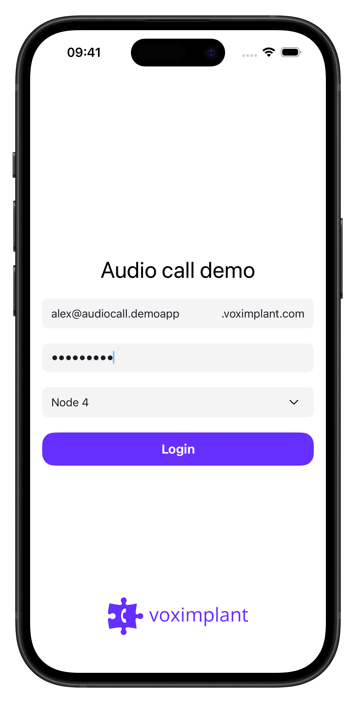
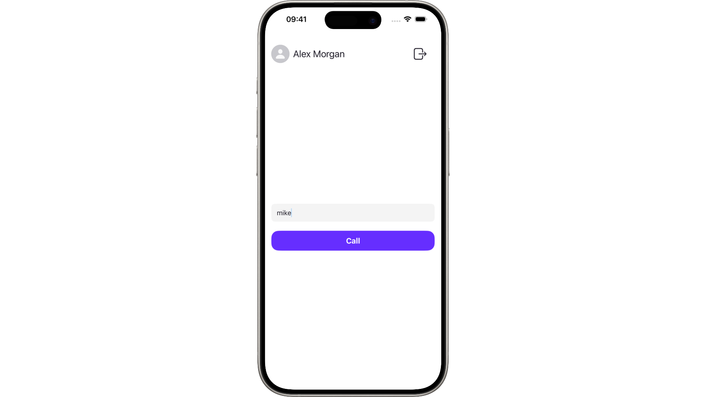
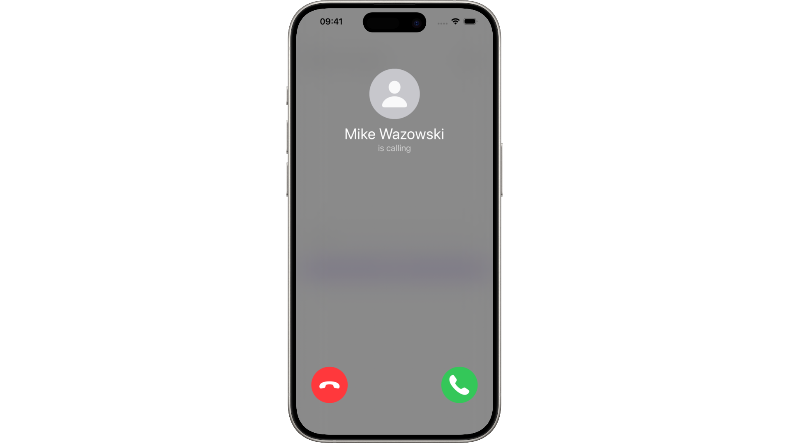
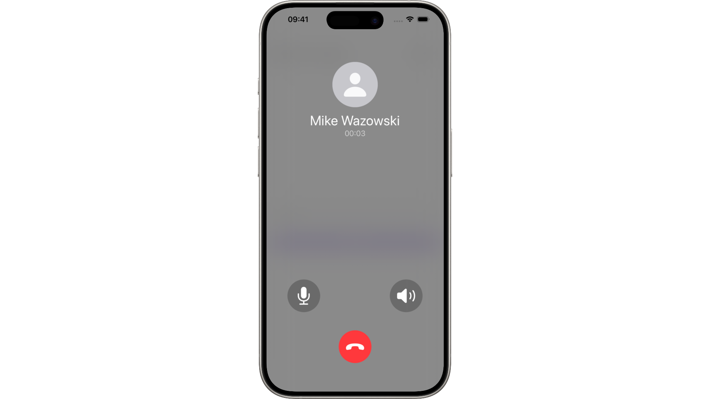
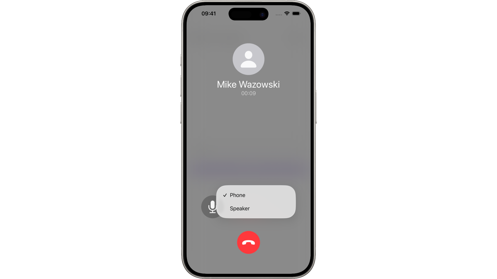

# Audio Call

A sample audio call demo application built with SwiftUI using the [Voximplant iOS SDK 3.x](https://github.com/voximplant/ios-sdk-releases).

## Usage

### Login

 

### Active call

  

## Features

- Login with Voximplant credentials
- Make and receive audio calls
- Switch audio devices during a call

## Getting Started

1. Open `audio-call.xcodeproj` in Xcode.
2. Build and run on a real device or simulator.

## Invite Link

You can get access to the app via a TestFlight [invite link](https://testflight.apple.com/join/uvUKr1j4).

## Account Setup

Refer to the [main README](../README.md#voximplant-account-setup) for account configuration details.
