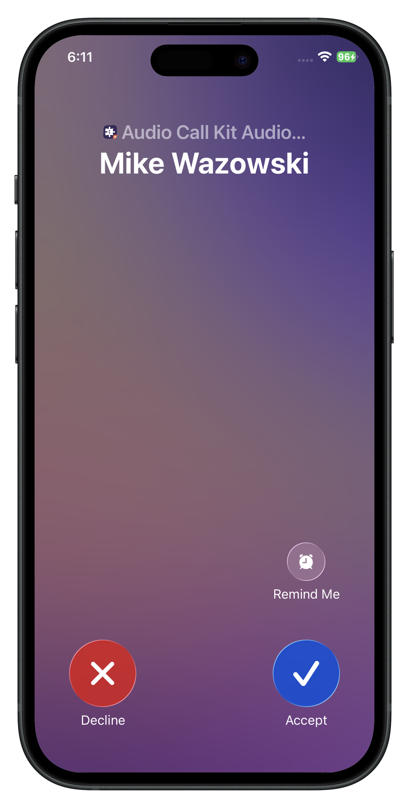
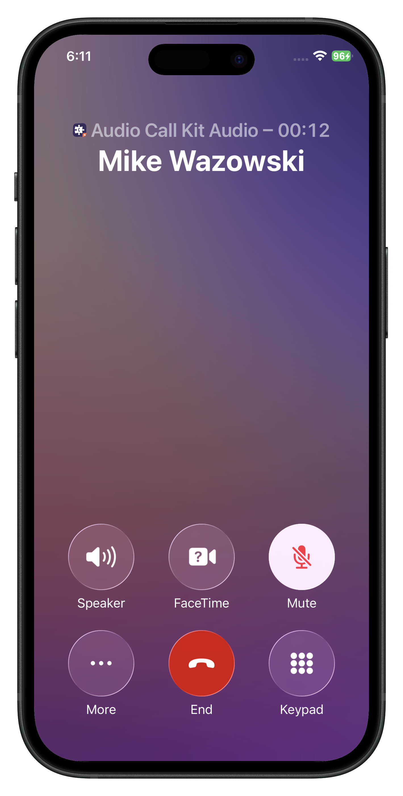

# Audio Call Kit

A sample audio call demo application with [CallKit](https://developer.apple.com/documentation/callkit) and [PushKit](https://developer.apple.com/documentation/pushkit) integration, built with SwiftUI using the [Voximplant iOS SDK 3.x](https://github.com/voximplant/ios-sdk-releases).

## Usage

### Login

 

### Active call

  

### CallKit 

 

## Features

- Login with Voximplant credentials
- Make and receive audio calls
- CallKit integration (native iOS call UI, call history, system call management)
- Push notifications for incoming calls

## Getting Started

1. Open `audio-call-kit.xcodeproj` in Xcode.
2. Build and run on a real device (required for CallKit).

## Invite Link

You can get access to the app via a TestFlight [invite link](https://testflight.apple.com/join/nJSzbTJt).

> [!WARNING]
> Please consider that you need to set up a Voximplant account to make calls.

> [!WARNING]
> Push notifications require additional setup. If the application is built from the source code, [set up push notifications](https://voximplant.com/docs/guides/sdk/ios-push). If the application was installed from the invite link, push notifications cannot be configured.

## Account Setup

Refer to the [main README](../README.md#voximplant-account-setup) for account configuration details.
